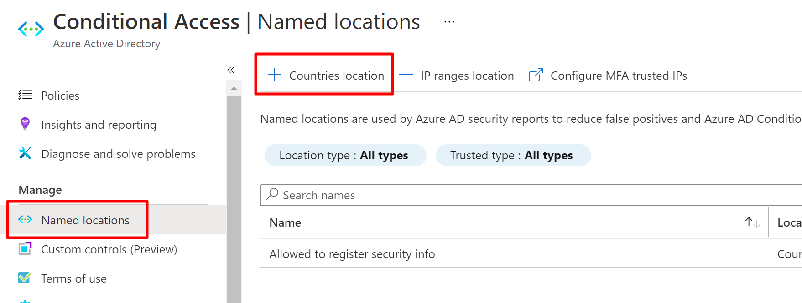

# Conditional Access Starter Pack

This repository contains a simple script that can help you deploy a good baseline of Conditional Access Policies to your Azure AD tenant. The following conditional access policies will be created, which should keep you covered in most circumstances:

- All apps - Block legacy authentication
- All apps - Require MFA for all guests
- All apps - Require MFA for all users assigned Azure AD roles
- All apps - Require MFA or compliant device for all users
- Azure management - Require MFA for all users
- Microsoft 365 - Enable session controls for all users
- Microsoft 365 - Require approved app for all users
- User action - Block register security info for all users when not in acceptable location
- User action - Require MFA for all users when registering device

## Prerequisites

- [PowerShell 7](https://docs.microsoft.com/en-us/powershell/scripting/install/installing-powershell-core-on-windows?view=powershell-7.1)
- [Microsoft.Graph - will be installed automatically](https://www.powershellgallery.com/packages/Microsoft.Graph)
- A named location is created in Azure AD, named **Allowed to register security info**, used to determine which countries are acceptable for users to be located in when self service registering SSPR or MFA



## Usage

- Download or clone this repository to a computer with PowerShell 7
- Start pwsh.exe (or similar for Mac and Linux)
- Navigate to the folder where you downloaded this repository and run Deploy.ps1 with the following parameters

|Parameter|Type|Description|
|-|-|-|
|Tenant|String|The x.onmicrosoft.com tenant name of the tenant where you want to deploy the CA policies|
|ExemptedAccounts|String array|A list of users that will be exempted from policies blocking or requiring MFA or other grant|

The script supports the **-WhatIf** parameter, if you want to "pretend" to run the script first, to see what it will do.

### Example

```PowerShell
.\Deploy.ps1 -Tenant "M365x843525.onmicrosoft.com" -ExemptedAccounts "AdeleV@M365x843525.OnMicrosoft.com","Admin@M365x843525.OnMicrosoft.com" -Verbose
```